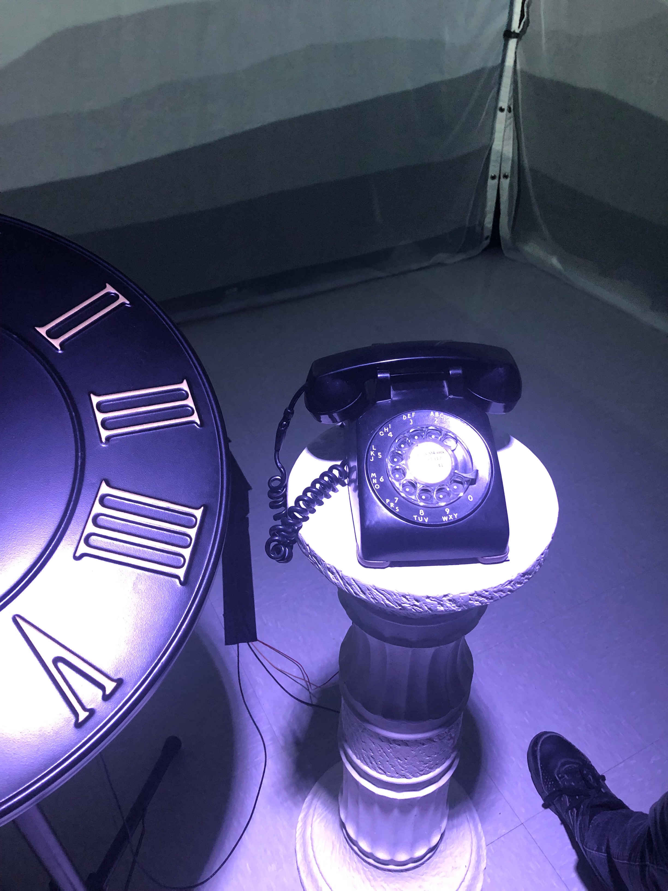

# Titre de l'œuvre
L'Horloge de l'apocalypse.

## Nom des l'artistes
Maxime Sabourin, Louis-Philippe Gravel, Alexis Lacasse, Tristan Girard-Montpetit et Maxime De Falco.

## Année de réalisation
22 mars 2022.

## Nom de l'exposition
Moebius.

## Lieu de mise en position
Petit studio, cégep Montmorency.

## Date de votre visite
23 mars 2022.

## Description de l'œuvre ou du dispositif multimédia.
Il y a une grosse horloge qu'on peut contrôler l'aiguille. À chaque heure on voyage dans le temps et arriver à 11h58 il reste 2 minutes avant la fin de l'humanité.

## Explications sur la mise en espace de l'œuvre.
On est dans une petite salle, au milieu il y a l'horloge et un téléphone. Autour il y avait des projections sur les toiles blanches.

 

## Listes des composantes et techniques de l'œuvre.
-4 haut-parleurs

-8 fils XLR 3

-Focusrite carte de son

-3 projecteurs vidéo lentille ultra wide 0.3

-3 système d'acrochage

-1 caméra Sony a6500

-un projecteur de lumière couleur

-2 fils XLR 3 conducteurs de 20'

-Console DMX

-Interface DMX USB

-1 ordinateur de l'école ou 2 si le premier ne suffit pas

-2 micro-contrôleur (Arduino)

-Kit de camera

-Kit de detection de présence (capteur de mouvement (kinect) pour le spotlight)

-1 potentiomètre

-Toile blanche (pour projection)

-1 bouton

-8 safety

## Liste des éléments nécessaires pour la mise en exposition.
-Téléphone

-Piédestal romain

-Horloge

 

# Expérience vécue:

## description de l'expérience.
On était dans une pièce seule avec juste les images autour de nous avec l'horloge et un téléphone on était maître de nos actions. Rendu vers 11h58 il y avait une bombe nucléaire qui frappe la terre et juste après le téléphone se mets à sonner, puis on entend quelqu'un dire au bout: "Il est temps d'agir".

## Ce qui m'a plu.
J'ai aimé que l'horloge soit directe programmé avec les projecteur et j'ai aimé le fait qu'on pouvait changer de décor grâce à l'aiguille.

## aspect que je voudrais améliorer.
Ce que j'aurais rajouté ça serait qu'à chaque heure il y ais des énigmes parce que les gens on souvent tendance à chercher des mystères au lieu de juste observer. Aussi, comme énigme par exemple avec le téléphone il y aurait pu avoir plein de trucs à faire parce que tous ce qu'il fesait c'est de répéter la même phrase en boucle: "Il est temps d'agir", mais on peut rien faire de plus que juste bouger l'aiguille. Il y aurait pu avoir une fin où on réussie à sauver l'humanité selon nos actions.

## Ordre selon mes préférances
1-L'horloge de l'apocalypse, car c'était une expérience très appaisant et c'était super quand on manipulait le temps.

2-Chère Sasha, car on dirait vraiment qu'on vivait la vie de la personne.

3-Distorsion collective, j'ai quand même bien aimé car ça m'avait rappeler le quotidien en boucle des cours en ligne et j'ai ressentie de l'anxiété.

4-3 minutes, je pensais que l'expérience serait super, mais le jeu bugait et dans le casier je ne ressentait aucun stress le son n'était pas assez fort.

5-Jeu temporel, l'expérience était super mais les questions était interminable. Aussi, il y avait de l'intéraction inutile avec le personnage comme quand il bugait ou quand il changait d'apparence je trouvais cela inutile.

6-Chronaufrage, c'était beau mais la kinect pour moi marchait une fois sur deux.

## Références
https://tim-montmorency.com/2022/projets/L-horloge-de-l-apocalypse/docs/web/index.html
https://tim-montmorency.com/2022/
