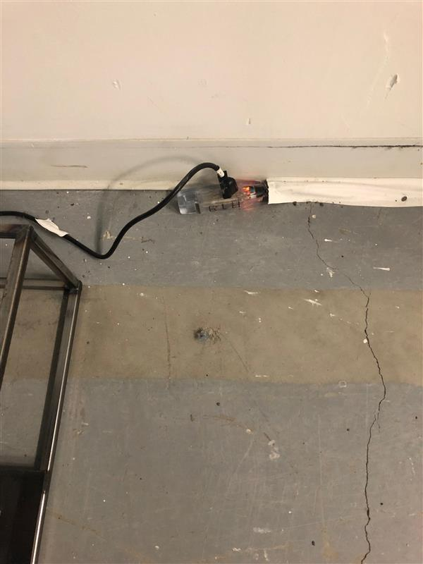
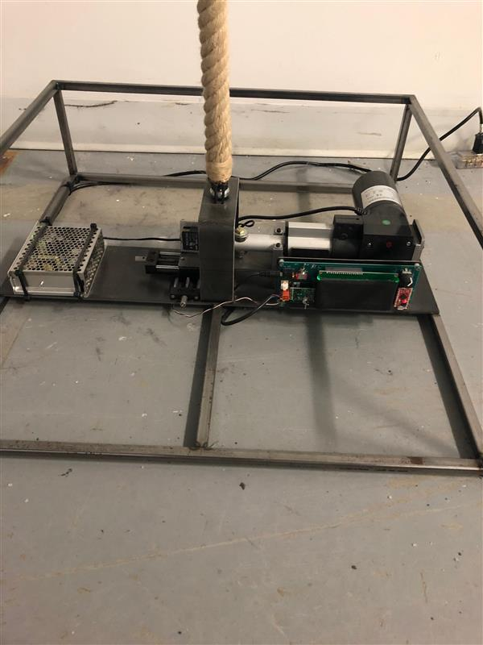

# Titre de l'œuvre
Bascule.

## Nom de l'artiste
Rafael Lozano-Hemmer.

# Année de réalisation
2016.

## Nom de l'exposition
METAMORPHOSIS.

## Lieu de mise en position
Arsenal art contemporain.

## Date de votre visite
9 février 2022.

## Description de l'œuvre ou du dispositif multimédia.
C'est une sculpture ressemblant à une corde de pendue, tenue par en bas, qui se balance. Selon le carpel de Rafael Lozano-Hemmer: « au rythme d'une fréquence des homicides par armes à feu en Amérique du Nord soit environ toutes les 10 à 15 secondes. »

 

# Explications sur la mise en espace de l'œuvre.
En gros, l'œuvre est placée dans une salle éclairée, car ce n'est pas un dispositif pour aller dans le noir. Il est prêt du mur de sorte qu'il soit bien branché. Autour de ses composants en bas, il y a des barres de métal qui les protègent. De plus, il y a beaucoup d'espace entre celle-ci et les autres œuvres.

    

## Listes des composantes et techniques de l'œuvre.
-Composantes électroniques
-Moteur
-Plateforme Arduino
-Langage de programmation Wiring
  

# Liste des éléments nécessaires pour la mise en exposition.
-Barre de métal
-Corde
-Acier
-Moteur

 

## Expérience vécue:

# description de l'expérience
J'ai trouvé cela très intéressant de voir une corde de pendue tenir sur un simple dispositif technologique. Aussi, son histoire m'a un peu choqué. En effet, l'œuvre en tant que tel représente la fréquence d'homicide en Amérique du Nord. Le balancement de la corde démontre ces statistiques à toutes les 10 à 15 secondes.

# Ce qui vous a plu
J'ai bien aimé le message transmis à travers l'œuvre, du fait que les homicides sont représentés par une corde et les morts représentés par chaque balancement. Je m'inspirerais probablement, puisque j'aime les arts avec une signification derrière.

# aspect que vous ne souhaitez pas retenir.
Personnellement, ce que j'aurais rajouté à l'œuvre, ce serait que la boucle de la corde se sert de manière infinie en même temps que le balancement.

# Références
https://lozano-hemmer.com/sway.php
