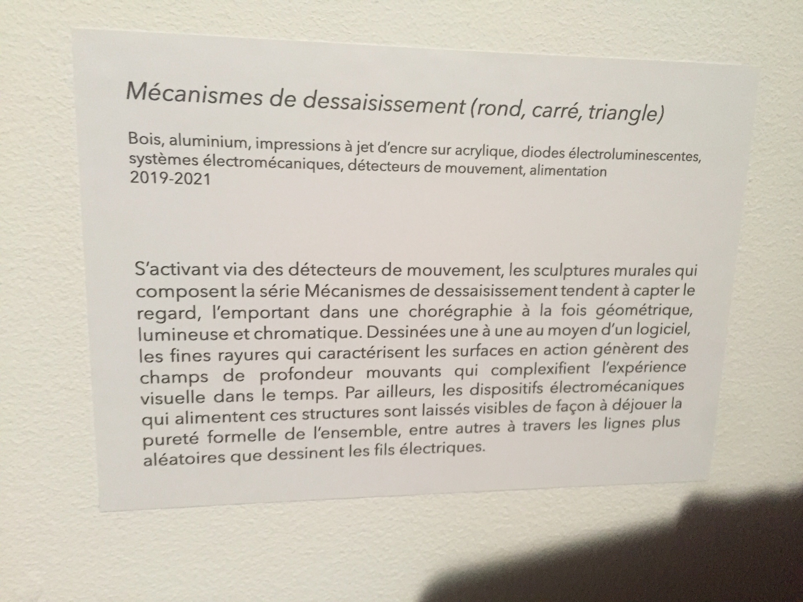
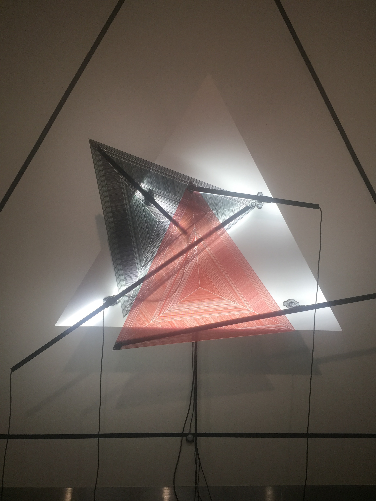
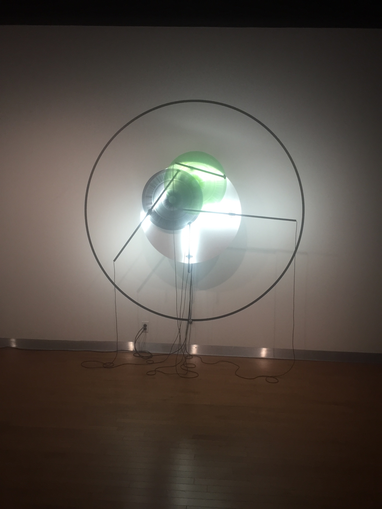

# Titre de l'œuvre
Mécanismes de dessaisissement (rond, carré, triangle)

## Nom de l'artiste
Inconnu

## Année de réalisation
2019-2021

## Nom de l'exposition
Configuration du sensible

## Lieu de mise en position
Maison des arts.

## Date de votre visite
16 mars 2022

## Description de l'œuvre ou du dispositif multimédia.
Ce sont des sculptures murales de forme ronde, triangle et carré qui s'activent grâce à un détecteur de mouvement. Il produit une chorégraphie géométrique, lumineuse et chromatique.

   

## Explications sur la mise en espace de l'œuvre.
Les œuvres sont directement placées sur un grand mur aligné avec une grande espace entre chacun. C'est à peu près la première chose que les visiteurs aperçoivent en rentrant dans la pièce. 

## Listes des composantes et techniques de l'œuvre.

-systèmes électromécaniques

-détecteurs de mouvement

-alimentation

## Liste des éléments nécessaires pour la mise en exposition.

-bois

-aluminium

-impressions à jet d'encre sue acrylique

-diodes électroluminescentes

# Expérience vécue:

## description de l'expérience.
Le mouvement était magnifique et hypnotisant. C'est vrai qu'avec les motifs dans les acryliques, on peut facilement observer une illusion brouillée. Cela donne envie de juste s'asseoir devant les œuvres pendant des heures et les contempler.

## Ce qui m'a plu.
J’ai bien aimé l'illusion visuelle, du fait que les lignes bougent telle une télévision brouillée. Il y avait aussi les lumières que j'ai trouvé très pertinentes, cela donnait un effet plus rayonnant. J'ai même aimé les trois formes : ronde, triangle et carré c'est comme s’il y avait trois univers différents.

## aspect que je ne souhaite pas retenir.
Il n'y a pas vraiment d'aspect que je ne souhaite pas retenir, car j'ai trouvé que tout était important, que ce soient les éléments techniques ou visuels. Le mouvement est beau et le design est fabuleux.

## Références

